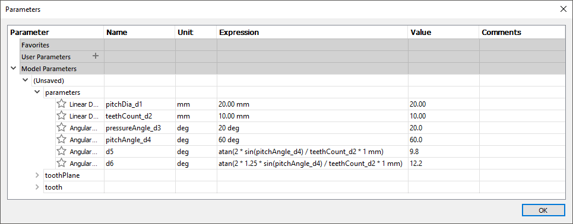
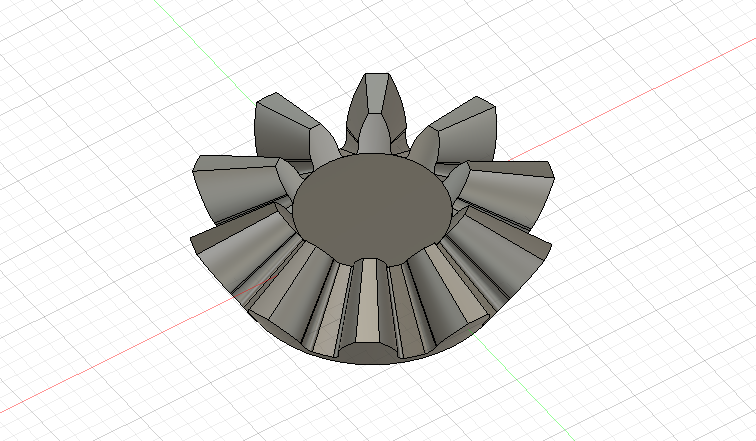

# YBevelGear

If you are like me, you regularly go back in the timeline and tweak stuff during
the design process in Fusion 360. The existing gear generators don't allow you
to do that. Once you enter the parameters, they cannot be changed. You can only
re-run the generator; however, it will break your history and references. Also,
many of the ready generators do not correctly generate under-cuts.

YBevelGear generator fixes all the problems above. Its usage is simple. Just run
the script, and it will generate two sketches: parameters and a tooth.
The parameters sketch contains all the parameters of the gear. I prefer to edit
these parameters using the parameters window, where you can see the names:

You can also use the parameter sketch to draw the stock of your gear and create
it by the rotate command.

The tooh sketch provide a drawing of a single tooth. You can use the loft
command with the cone tip point from the parameters sketch to cut a tooth.  Then
apply the circular pattern on the last operation to cut all the teeths.

To calculate the parameters of the bevel gear (i.e. pitch angle) you can use [online calculator by Otvinta](http://www.otvinta.com/bevel.html).

